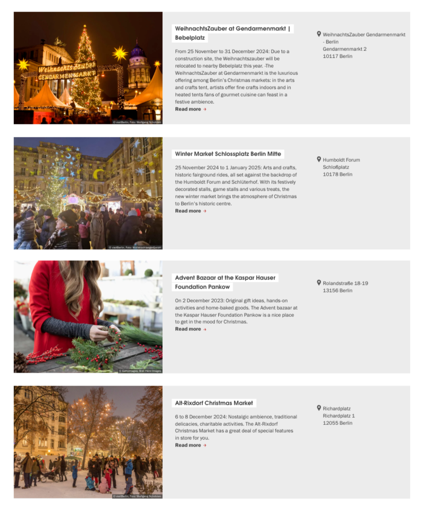
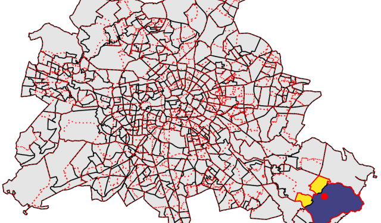
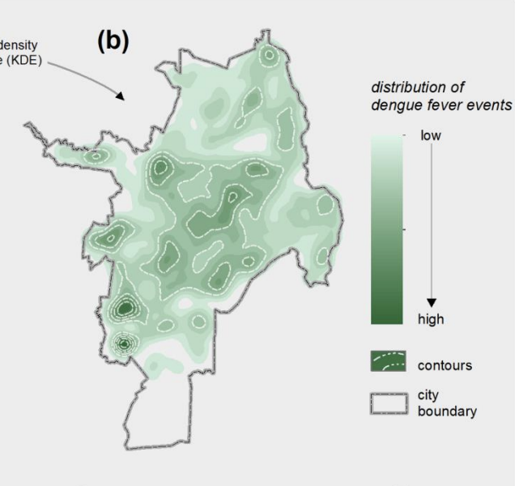
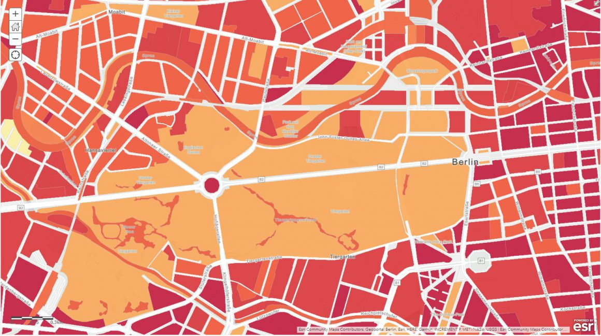

```{css, echo=FALSE} 
@media print { # print out incremental slides; see https://stackoverflow.com/questions/56373198/get-xaringan-incremental-animations-to-print-to-pdf/56374619#56374619
  .has-continuation {
    display: block !important;
  }
}
```

```{r setup, include=FALSE}
# figures formatting setup
options(htmltools.dir.version = FALSE)
library(knitr)
opts_chunk$set(
  comment = "  ",
  prompt = T,
  fig.align="center", #fig.width=6, fig.height=4.5, 
  # out.width="748px", #out.length="520.75px",
  dpi=300, #fig.path='Figs/',
  cache=F, #echo=F, warning=F, message=F
  engine.opts = list(bash = "-l")
  )

## Next hook based on this SO answer: https://stackoverflow.com/a/39025054
knit_hooks$set(
  prompt = function(before, options, envir) {
    options(
      prompt = if (options$engine %in% c('sh','bash')) '$ ' else 'R> ',
      continue = if (options$engine %in% c('sh','bash')) '$ ' else '+ '
      )
})

library(tidyverse)
library(kableExtra)
library(here)
```


```{r}

```


# Table of contents

<br>

1. [What is Geospatial Analysis?](#intro)

2. [The Simple Features (sf) Package](#method)

3. [Application: Berlin's Christmas Markets](#casestudy)

4. [Further Resources](#links)


<!-- ############################################ -->
---
class: inverse, center, middle
name: intro

# What is Geospatial Analysis?

<html><div style='float:left'></div><hr color='#EB811B' size=1px style="width:1000px; margin:auto;"/></html>

---

# Hook

### Scenario
You want to go to Christmas Markets.

---
# Hook

### Scenario
You want to go to Christmas Markets.

<b>Question:</b> Which ones are closest to Hertie? If you want to visit as many as possible in a day where should you go? 


---
# Hook

### Scenario
You want to go to Christmas Markets.

<b>Question:</b> Which ones are closest to Hertie? If you want to visit as many as possible in a day where should you go? 

.pull-left[
<div align="center">

</div>
]


---
# Hook

### Scenario
You want to go to Christmas Markets.

<b>Question:</b> Which ones are closest to Hertie? If you want to visit as many as possible in a day where should you go? 

.pull-left[
<div align="center">

</div>
]

.pull-right[
<div align="center">

</div>
]
---
# Geospatial Analysis

Geospatial analysis can help us answer public policy questions such as
- Zoning
- Traffic accidents
- Climate change
- Pandemic

<div align = "center", style="display: flex; align-items: center; justify-content: center;">



</div>

.footnote[<sub>Images taken from (from left to right):
[WZB Data Science Blog](https://gis-iq.esri.de/klimawandel-im-unterricht-das-stadtklima-in-berlin/), [Spatial Analysis and Health (Delmelle & Kanaroglou, 2015)](https://pages.charlotte.edu/eric-delmelle/wp-content/uploads/sites/150/2012/12/IntroductionSpatialAnalysisAndHealthDelmelleKanaroglou.pdf), [GIS IQ Blog](https://gis-iq.esri.de/klimawandel-im-unterricht-das-stadtklima-in-berlin/)
]

---

class: inverse, center, middle
name: method

# The Simple Features (sf) Package

<html><div style='float:left'></div><hr color='#EB811B' size=1px style="width:1000px; margin:auto;"/></html>

---

# Simple Features (sf) Package

.pull-left[
The simple features package has a pocket of functions to help us <b>create maps, translate data into coordinates, and operate on the maps</b> we’ve created. 

It also <b>integrates with tidyverse</b>, meaning we can easily use dplyr and ggplot to manipulate and visualise data. 
]

.pull-right[
<br>
<div align="center">

</div>
]

---
class: inverse, center, middle
name: casestudy

# Application: Berlin's Christmas Markets

<html><div style='float:left'></div><hr color='#EB811B' size=1px style="width:1000px; margin:auto;"/></html>


---

# Mapping Berlin's Christmas Markets

###sf Package in essence
To represent the geographic placement of an object you need two pieces of information: the coordinates of the object and a system of reference for how the coordinates relate to a physical location on Earth.<sup>1</sup>

.footnote[<sup>1</sup>This explanation is borrowed from [Jesse Sadler](https://www.jessesadler.com/post/gis-with-r-intro/)]


###Steps Breakdown
1. Set up the system of reference (the map of Berlin)
2. Obtain the coordinates of the objects of interest (Christmas Markets)
3. Plot the objects onto the system of reference

---
# Mapping Berlin's Christmas Markets

### Step 1: Set up the system of reference
```{r mpg-layers-1, tidy=FALSE, message=FALSE, fig.show="hide", fig.dim=c(4.8, 5), out.width="100%"}
library(sf)

districts_file <-"data/bezirksgrenzen.geojson"
berlin_districts <- st_read(districts_file) #<<

```


---
# Mapping Berlin's Christmas Markets

###Step 1: Set up the system of reference
```{r}
berlin_districts %>%
  select(Gemeinde_name, geometry)
```
]

---
# Mapping Berlin's Christmas Markets

###Step 1: Set up the system of reference

.pull-left[
```{r mpg-layers-2, tidy=FALSE, message=FALSE, fig.show="hide",fig.align='right',fig.dim=c(4.8,5), out.width="100%"}
ggplot()+
  geom_sf(data=berlin_districts) + #<<
  theme_minimal()

```
]
.pull-right[
`)
]
---
# Mapping Berlin's Christmas Markets

###Step 2: Finding the coordinates of the objects

<style>
pre code {
  white-space: pre-wrap;    
  word-wrap: break-word;   
}
</style>

```{r, echo = TRUE}
christmas_markets_url <- "https://www.berlin.de/sen/web/service/maerkte-feste/weihnachtsmaerkte/index.php/index/all.geojson?q="
christmas_markets <- st_read(christmas_markets_url)
```

---
# Mapping Berlin's Christmas Markets

###Step 2: Finding the coordinates of the objects
```{r}
christmas_markets %>%
  select(title, geometry)
```


---
# Mapping Berlin's Christmas Markets

###Step 2: Finding the coordinates of the objects
.pull-left[
```{r mpg-layers-3, tidy=FALSE, message=FALSE, fig.show="hide",fig.align='right',fig.dim=c(4.8,5), out.width="100%"}
ggplot() +
  geom_sf(data=christmas_markets) + #<<
  theme_minimal()
```
]
.pull-right[
`)
]

---
# Mapping Berlin's Christmas Markets

###Step 3: Plotting the Christmas Markets onto Berlin's map
####Aligning coordinate systems and filtering for Berlin data
```{r}
# Making sure the coordinates reference systems are the same (referring to the same map)
st_crs(christmas_markets) <- st_crs(berlin_districts) #<<

# Filter markets to keep only those within the Berlin districts
christmas_markets_berlin <- st_intersection(christmas_markets, berlin_districts) #<<
```

---
# Mapping Berlin's Christmas Markets

###Step 3: Plotting the Christmas Markets onto Berlin's map
.pull-left[
```{r mpg-layers-4, tidy=FALSE, message=FALSE, fig.show="hide",fig.align='right', out.width="100%"}
ggplot() +
  geom_sf(data = berlin_districts) + 
  geom_sf(data = christmas_markets_berlin) +
  theme_minimal()
```
]


.pull-right[
`)
]
---
# Mapping Berlin's Christmas Markets

###Step 4: Styling the map
Filling in color to match the Christmas theme. 

<div align="center">

</div>

---
# Further Resources

###For an overview and deep dive into the backend of the packages 
- [sf Vignettes](https://r-spatial.github.io/sf/articles/)
- [Chapter 2 Geographic data in R of Geocomputation with R by Robin Lovelace, Jakub Nowosad and Jannes Muenchow](https://r.geocompx.org/spatial-class.html#sf-classes)

###Cheat sheet of functions
- https://github.com/rstudio/cheatsheets/blob/main/sf.pdf

###Case studies with step by step walkthroughs 
- [Simple Features Tutorial in R by Rob Wiederstein](https://www.robwiederstein.org/2022/03/28/simple-features-tutorial-in-r-number-2/)
- [Introduction to GIS with R by Jesse Sadler](https://www.jessesadler.com/post/gis-with-r-intro/)


